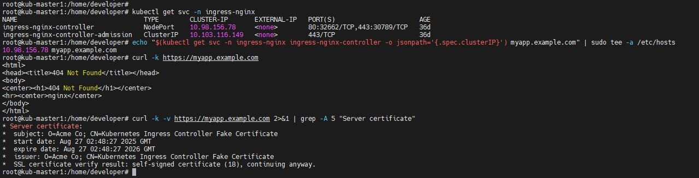

Домашнее задание к занятию «Настройка приложений и управление доступом в Kubernetes» - Бычков Д.В.

Задание 1: Работа с ConfigMaps

deployment.yaml --- https://github.com/dvbychkov/kuber-homeworks-2.3-2.3.md/blob/master/deployment.yaml

configmap-web.yaml --- https://github.com/dvbychkov/kuber-homeworks-2.3-2.3.md/blob/master/configmap-web.yaml

Задание 2: Настройка HTTPS с Secrets

secret-tls.yaml --- https://github.com/dvbychkov/kuber-homeworks-2.3-2.3.md/blob/master/secret-tls.yaml

ingress-tls.yaml --- https://github.com/dvbychkov/kuber-homeworks-2.3-2.3.md/blob/master/ingress-tls.yaml

Задание 3: Настройка RBAC

role-pod-reader.yaml --- https://github.com/dvbychkov/kuber-homeworks-2.3-2.3.md/blob/master/role-pod-reader.yaml

rolebinding-developer.yaml --- https://github.com/dvbychkov/kuber-homeworks-2.3-2.3.md/blob/master/rolebinding-developer.yaml
